# Hiking Club Application Threat Model

## Part 1: Secure Design Document Overview

### Project Description
The Georgia Hiking Club (GHC) application is a comprehensive platform designed to facilitate and manage guided hiking trips across various locations. The system enables trip leaders to organize and manage hiking events while providing users with tools to discover, join, and track their hiking activities. The application features a sophisticated user management system that includes member ratings, trip leader certifications, and privacy controls to ensure user safety. Additionally, it incorporates location-based search capabilities and performance metrics to enhance the hiking experience while maintaining user privacy and security. The platform supports real-time trip updates, emergency contact management, and weather integration to ensure safe hiking conditions. Users can track their hiking history, earn achievements, and connect with other hikers while maintaining control over their personal information and activity visibility.

### Organization Profile
The Georgia Hiking Club (GHC) serves as the primary organization utilizing this application, alongside other local Georgia-based outdoor activity groups. While the platform is open to public access, it offers specialized features for organizational members, including private trip management and leader verification systems. The application serves as a central hub for organizations to coordinate outdoor activities, verify trip leaders, and maintain safety standards for their members. The GHC operates as a non-profit organization with a focus on promoting safe and responsible hiking practices throughout Georgia. The organization maintains partnerships with local parks, conservation groups, and emergency services to ensure comprehensive support for all hiking activities. The platform's organizational features include member management, event scheduling, and resource allocation tools specifically designed for hiking club operations.

### Deployment Environment
The application will be deployed as a monolithic system hosted on dedicated web servers within the GHC's non-profit office infrastructure. The deployment strategy includes local hosting to optimize performance for Georgia-based users, load balancing for traffic management, multi-layer firewall protection, static IP allocation from local ISP, containerized deployment using Docker for both frontend and backend services, and an isolated database server with restricted access. The infrastructure is designed to handle peak usage during popular hiking seasons and maintain high availability for emergency situations. The system architecture prioritizes data security and privacy while ensuring reliable access for authorized users. Regular maintenance windows are scheduled during off-peak hours to minimize service disruption.

### Security Considerations
This application needs robust security around authentication and user privacy. There is a real threat to people stalking individuals in the real world or planning attacks where they will be in the future. There will be a score system to show off how often they hike as well as how many trips they have been on, but this needs to not give away which locations they use the most. The authentication needs to ensure people are regular members, trip leaders, and administrators, and ensure there is no way to spoof which member is which to avoid creating false leaders for parties. People are relying on the leaders to be certified and there for the protection of the group. Since medical information will be stored, there needs to be no way that medical data, even if leaked, can be viewed by outside entities. The system must implement strict access controls for sensitive information, including emergency contact details and medical conditions. Location data must be carefully managed to prevent tracking of individual users while still providing necessary information for trip planning and safety. The platform must maintain detailed audit logs of all system access and modifications to ensure accountability and enable rapid response to security incidents.

## Part 2, A: Diagram

## Diagram Code

## Part 2, B: STRIDE Threat Model

### Spoofing
A significant spoofing threat exists around user authentication. Since complex passwords are not enforced, an attacker could spoof a legitimate user's identity (member, trip leader, or administrator) through brute-force attacks, gaining unauthorized access to their account. This could lead to a trip leader spoofing another leader's identity to modify events they didn't post, or an administrator spoofing a system admin to make unauthorized changes to the entire system.

### Tampering
Data integrity is at risk of tampering. An attacker could tamper with event registration numbers, falsely inflating or deflating participant counts, leading to operational issues. Tampering with medical information or performance notes stored in member profiles could have dangerous consequences during hikes. Furthermore, unauthorized modification of payment records or deadlines by a malicious insider could lead to financial discrepancies.

### Repudiation
Trip leaders could potentially repudiate actions they performed, such as marking a member as "No Show" or dropping them from an event. Without robust logging and auditing, a leader could deny making such changes, leading to disputes and undermining the club's policies. Similarly, members could repudiate their registration for events, falsely claiming they never signed up, especially if no clear audit trail exists.

### Information Disclosure
Confidential information, including members' medical conditions, performance notes, and payment histories, is stored within the application. Unauthorized access to the backend database server or a successful injection attack on the front-end could lead to the disclosure of this sensitive data. Trip leaders also have access to confidential member information, and if their accounts are compromised, this information could be disclosed.

### Denial of Service (DoS)
The web application is the core of the business and its unavailability would severely impact the club's operations. A DoS attack targeting the Front End Web Server could prevent members from registering for events, leaders from posting trips, and even disrupt payment processing. Such an attack could be launched by overwhelming the server with traffic, making it unresponsive to legitimate requests.

### Elevation of Privilege
A regular member could attempt to elevate their privileges to that of a trip leader or even an administrator. This could occur if vulnerabilities exist in the authorization logic, allowing a member to bypass checks and gain access to functionalities reserved for higher-privileged users, such as posting events or viewing confidential member details. For example, if a member could manipulate their profile data to gain leader capabilities.

## Part 2, C: OWASP Threat Model

### Assessment Scope
The application handles sensitive user financial and medical information, along with real-time data on where users will be located during trips. If users get injured or data is leaked, it could hurt the reputation of the GHC organization. Since we are using a private server, localized attacks to take down the service are also a higher priority. Making sure the services fail gracefully in the event of attacks will help keep vital services active for users at all times. Finding ways to engage users with scores and privately track medical conditions while relaying important information to trip leaders will require unique solutions to ensure safety and privacy.

### Vulnerabilities
Having weak authentication and brute force login systems can lead to breaches and unauthorized access to user accounts. Since user trips will be planned in the future, if someone gains access to their account, they could intercept them in real life. Since medical records are stored in the medical database, encryption needs to be used, but also a way so that only the user's account can view uploaded medical data. There also needs to be an anonymous group for medical concerns that is delivered to trip leaders without leaking individual medical history to the trip leader. Since data is entered by the user, there needs to be input validation on all user fields to avoid cross-site scripting attacks. Logging is needed to verify interactions between users to make sure there is a system that can be reviewed in disputes. Location data will also be tracked in real-time, in case of an emergency event, emergency services can be dispatched to the last known location. These logs also need to be encrypted and only used by administrators. There can still be a major coordinated attack on users once locations are leaked and DDOS attacks are performed to take down services to avoid any logging or tracking of the attack.

### Countermeasures
Using OAuth social logins will help to guarantee that accounts from real people are used for the services. A limited login attempt will aid in blocking brute force attempts. Encryption and hash systems built on the medical and logging systems will also help in preventing data breaches. Using a JWT token system so internal APIs can only communicate between services will also ensure that only the proper authorized requests can request data from their specific service. Rate limiters and firewalls will also protect the web server from DDOS attacks. Logging will also aid in finding attackers and blocking the common IP addresses of attackers. Offering regional access can also aid in making sure only people in Georgia are using the service, with the exception of users on trips outside of Georgia.

### Prioritized Risks
Unauthorized access is the highest risk to user data. Any flaws in the authentication system pose a severe risk to users. Since data is entered by users, cross-site scripting attacks are also a high risk for the application. Finding ways to avoid data breaches and keeping any sensitive data encrypted will be important in designing the systems. Making sure only certified trip leaders can organize events is also a high risk. Users are relying on events to provide safe trips for their members.

## References
https://owasp.org/www-community/Threat_Modeling_Process
https://wiki.owasp.org/index.php/Category:Threat_Modeling
https://owasp.org/www-community/Threat_Modeling
https://owasp.org/www-project-top-ten/